# And the protein/ligand went boom
A collection of various computational chemistry/biochemistry fails.

To quote the Gromacs manual: https://manual.gromacs.org/current/user-guide/terminology.html#blowing-up

> Blowing up is a highly technical term used to describe a common sort of simulation failure. In brief, it describes a failure typically due to an unacceptably large force that ends up resulting in a failure of the integrator.

It is annoying, but the artwork is fun!

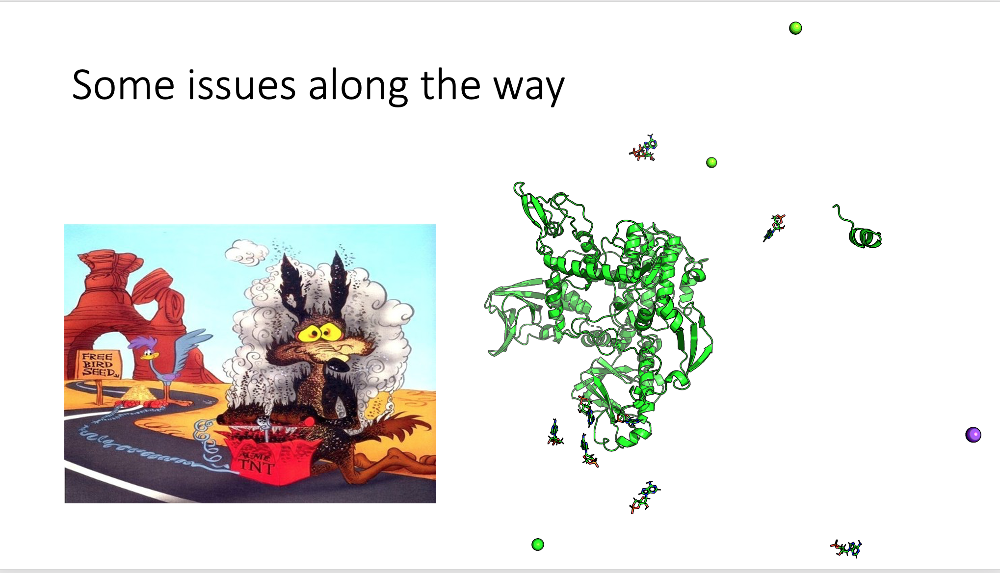

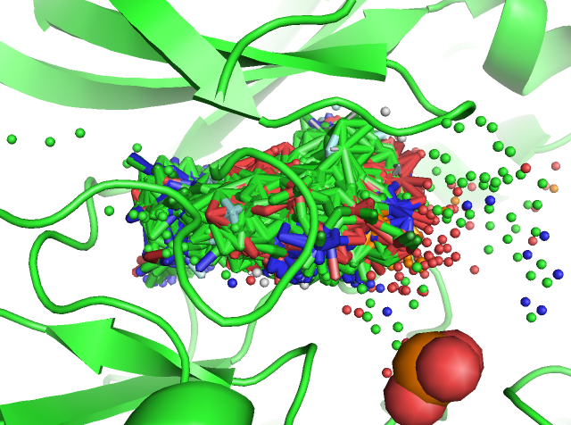

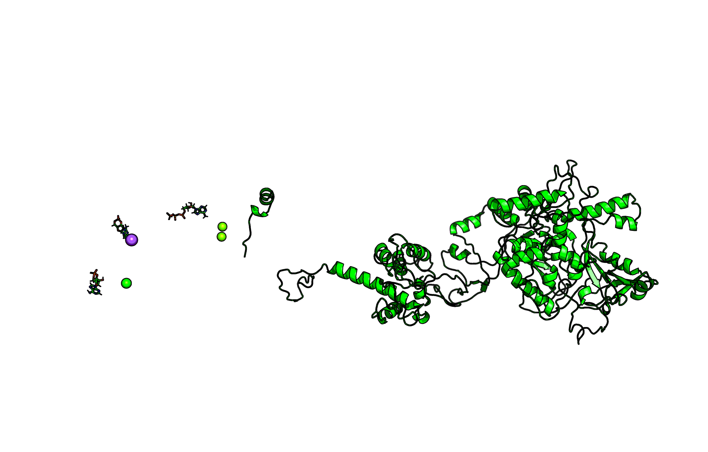

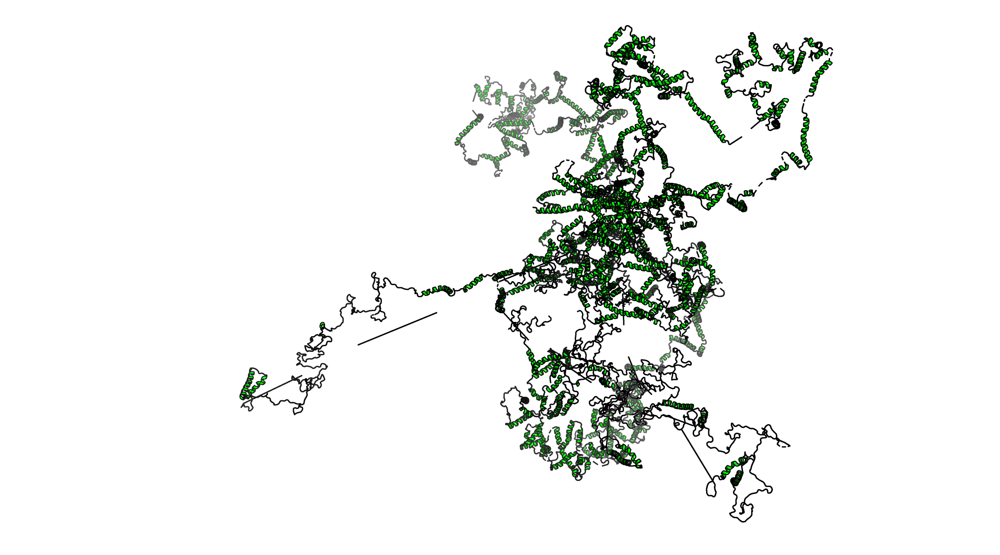

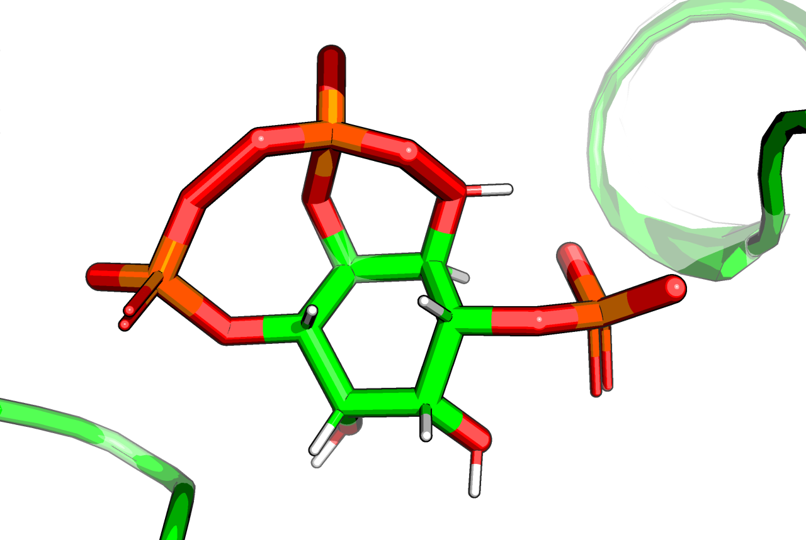

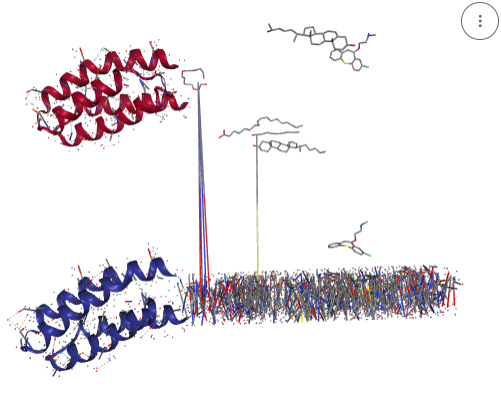

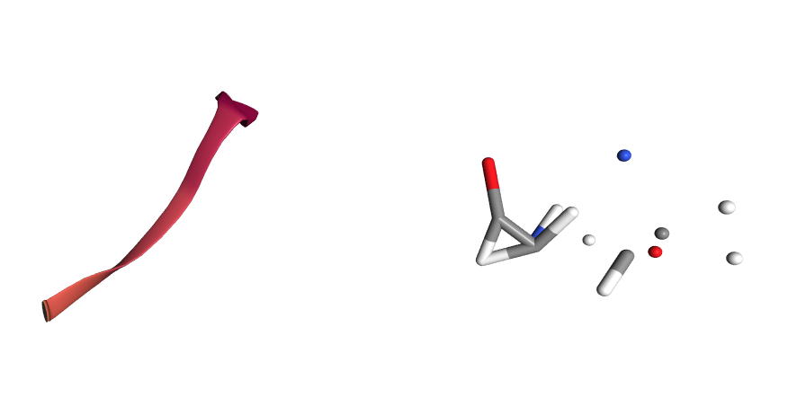

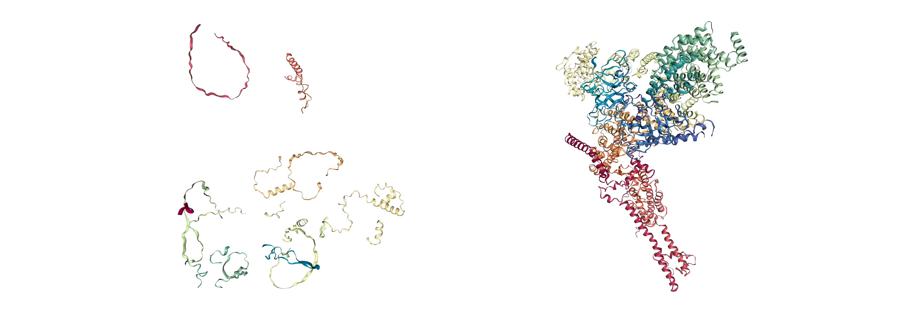

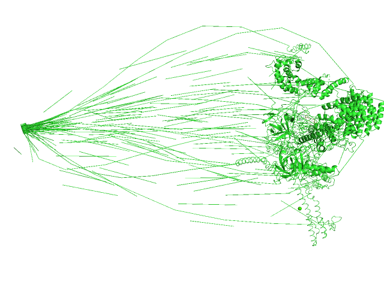

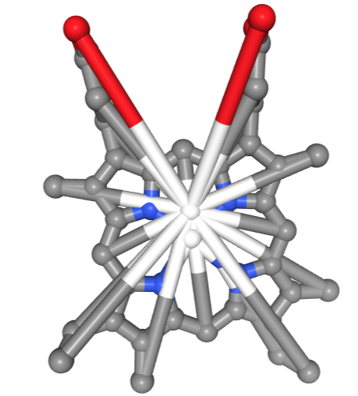

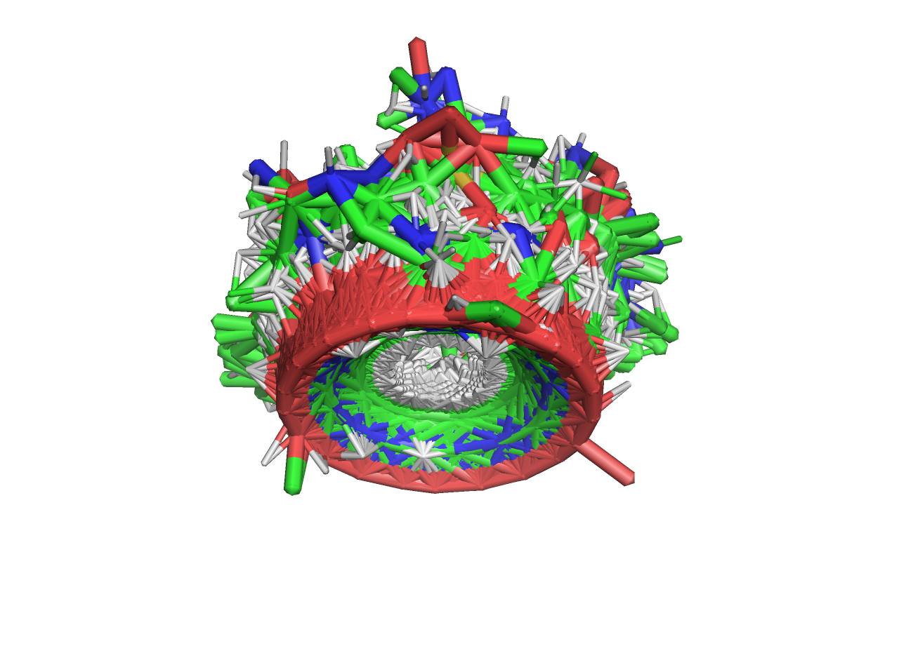

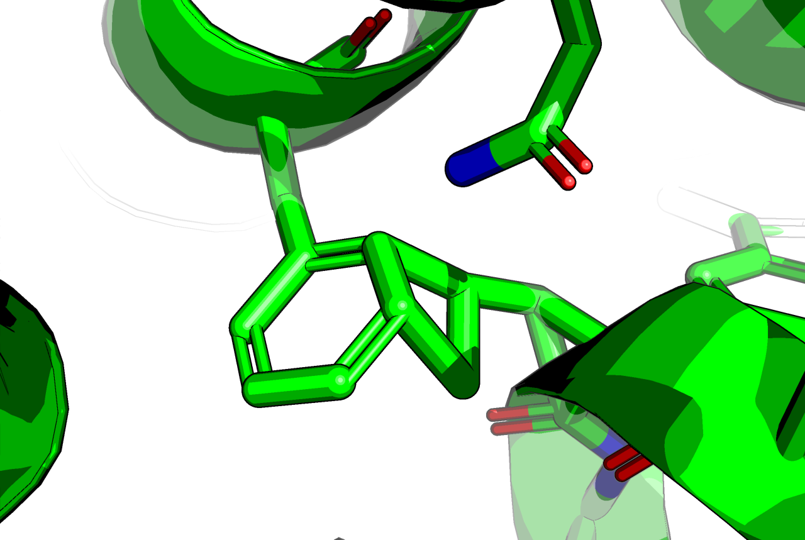

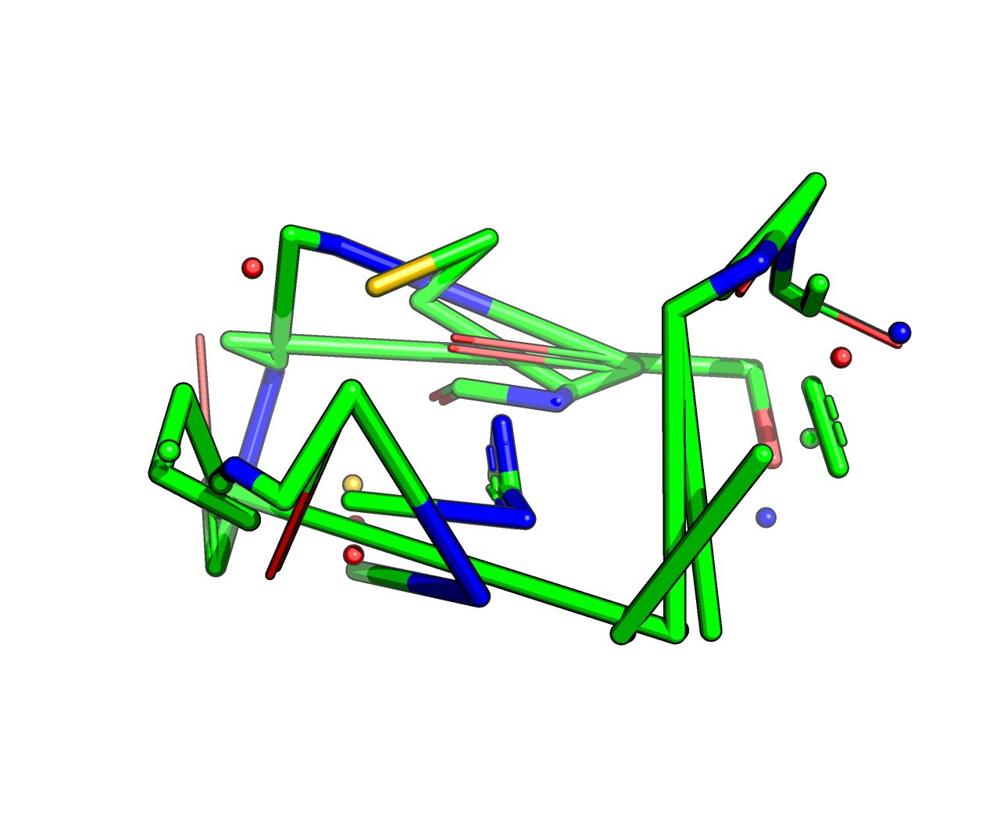
